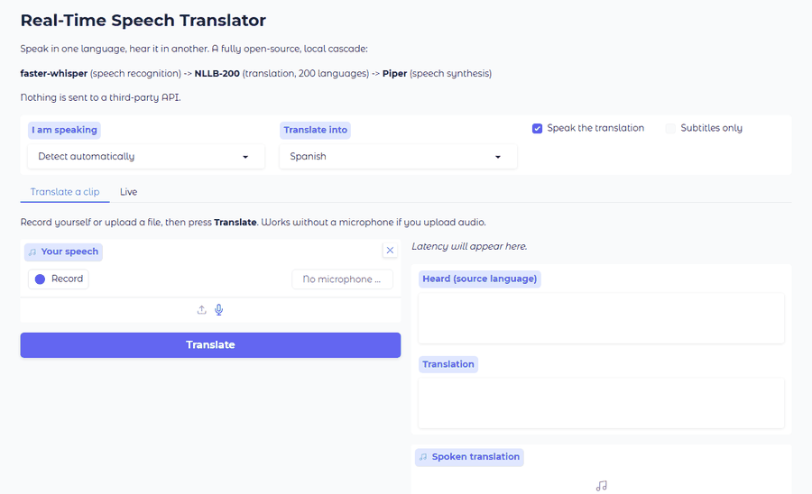

# Real-Time Multilingual Speech Translator

Speak in one language, hear it in another — locally, with no cloud API.
**97 source languages, 200 translation targets, 48 spoken output voices.**

[](https://github.com/gebrilfradj/realtime-speech-translator/actions/workflows/ci.yml)
[](https://www.python.org/downloads/)
[](LICENSE)

> **2.7 s end-to-end for 4.5 s of speech — a real-time factor of 0.61 on a CPU-only machine, with no GPU.**
> Speech recognition 1119 ms · translation 1365 ms · synthesis 257 ms.
> (Median of 5 runs; the demo below shows a 2.4 s run.)



*Recorded from the actual web UI by [`scripts/record_demo.py`](scripts/record_demo.py) — it drives a real
browser against a running server, so the GIF cannot drift from what the code does.*

---

## Try it

```bash
git clone https://github.com/gebrilfradj/realtime-speech-translator.git
cd realtime-speech-translator

python -m venv .venv
source .venv/bin/activate          # Windows: .venv\Scripts\activate
pip install -r requirements.txt

python -m speech_translate.webui    # browser demo at http://127.0.0.1:7860
```

Or with Docker, no Python setup at all:

```bash
docker build -t speech-translate .
docker run --rm -p 7860:7860 -v st-cache:/home/app/.cache speech-translate
```

Models download on first run (~1.5 GB) and are cached afterwards.

---

## The pipeline

```
microphone ─► VAD ─► faster-whisper ─► NLLB-200 ─► Piper ─► speakers
              │        (ASR)            (MT)       (TTS)
              └── utterance segmentation, not fixed chunks
```

| Stage | Model | Why this one |
|---|---|---|
| **ASR** | [`faster-whisper`](https://github.com/SYSTRAN/faster-whisper) (CTranslate2) | Whisper accuracy with int8 quantisation, and it can run distilled checkpoints that `openai-whisper` cannot load at all |
| **MT** | [`facebook/nllb-200-distilled-600M`](https://huggingface.co/facebook/nllb-200-distilled-600M) | 200 languages, actively maintained, stronger than M2M100-418M |
| **TTS** | [Piper](https://github.com/OHF-Voice/piper1-gpl) (ONNX VITS) | Synthesises far faster than real time on a CPU; 170 voices across 49 languages |

Every stage sits behind a small interface, so swapping a model is a class, not a
rewrite — that is how all three were replaced without touching the pipeline logic.

---

## Measured performance

Same machine (CPU-only cloud VM, Intel Xeon Ice Lake, no GPU), same 4.5 s clip,
median of 5 runs after warm-up. Totals are the sum of the stage medians. Reproduce with:

```bash
python -m speech_translate.benchmark --audio sample.wav --tgt es --legacy
```

| Configuration | ASR | MT | TTS | Total | RTF |
|---|---:|---:|---:|---:|---:|
| Original stack (`openai-whisper small` + M2M100-418M) | 3438 ms | 1235 ms | — | 4673 ms | 1.04 |
| faster-whisper `small` + NLLB-600M + Piper | 3209 ms | 1432 ms | 253 ms | 4894 ms | 1.09 |
| **faster-whisper `base` + NLLB-600M + Piper (default)** | **1119 ms** | **1365 ms** | **257 ms** | **2741 ms** | **0.61** |

RTF (real-time factor) = processing seconds per second of audio. **Below 1.0 means
the system keeps up with a live speaker.**

**An honest note on the speed-up.** Swapping the *runtime* alone (openai-whisper →
faster-whisper at the same `small` model size) was worth only ~1.07× on ASR on this
CPU; CTranslate2's large gains need a GPU or AVX-512 VNNI. The real win is that
faster-whisper makes smaller and distilled checkpoints practical, which is what takes
the system from "slower than real time" to comfortably ahead of it:

| ASR model | Latency (4.5 s clip) | RTF | Notes |
|---|---:|---:|---|
| `tiny` | 600 ms | 0.13 | Lowest accuracy |
| **`base` (default)** | **1097 ms** | **0.24** | Best speed/accuracy balance |
| `distil-small.en` | 1529 ms | 0.34 | English only; cannot run on `openai-whisper` |
| `small` | 3270 ms | 0.73 | Most accurate; use `--asr-model small` |

NLLB-600M costs ~18% more than M2M100-418M per translation. That is a deliberate
trade: 200 languages and better quality for a fraction of the budget that dropping
one ASR model size gives back.

---

## Usage

```bash
# Live microphone translation
python -m speech_translate --tgt es                 # auto-detect source → Spanish
python -m speech_translate --src en --tgt ja        # pin the source (slightly faster)
python -m speech_translate --tgt fr --no-speak      # subtitles only, no audio out
python -m speech_translate --tgt de --asr-model small   # trade latency for accuracy

# Translate a recording
python -m speech_translate --file talk.wav --tgt de --save-transcript out.txt

# Discovery
python -m speech_translate --list-devices           # microphones
python -m speech_translate --list-languages         # 98 language codes

# Browser demo, benchmark, sample audio
python -m speech_translate.webui --share
python -m speech_translate.benchmark --audio sample.wav --tgt es
python -m speech_translate.make_sample --lang en --out sample.wav
```

Language codes are flexible: `es`, `spa_Latn`, `es-ES` and `Spanish` all work.
Unknown codes fail immediately with a suggestion rather than silently
mistranslating.

### As a library

```python
from speech_translate import Pipeline, Settings

pipeline = Pipeline(Settings(src="auto", tgt="spa_Latn")).warmup()
result = pipeline.process_file("sample.wav")

print(result.source_language_name)   # 'English' (detected)
print(result.transcript)             # 'Hello, how are you today? ...'
print(result.translation)            # 'Hola, ¿cómo estás hoy? ...'
print(result.real_time_factor)       # 0.61
result.speech.save("out.wav")
```

Importing the package loads no models and opens no audio devices.

---

## What was wrong, and what changed

This started as an undergraduate research project. It worked in a demo and broke
everywhere else. The rebuild fixed the following — each one is now covered by a test.

### Correctness

| Problem | Fix |
|---|---|
| `requirements.txt` listed **`whisper`**, which on PyPI is [Graphite's time-series database](https://pypi.org/project/whisper/), not OpenAI's. It imports fine and then has no `load_model`, so **CI passed while the app was fundamentally broken**. | Depend on `faster-whisper`. A [CI job](.github/workflows/ci.yml) now fails the build if `whisper` ever reappears. |
| `--src auto` discarded Whisper's detected language and passed the literal string `"auto"` to the translator as a language code. | The recogniser returns the detected language; it is mapped ISO 639-1 → FLORES-200 and forwarded. Regression-tested. |
| `make_sample.py` imported `pyttsx3`, which was not a declared dependency. | Declared, plus a [CI check](scripts/check_dependencies.py) that every third-party import appears in `pyproject.toml`. |
| `MIC_INDEX = 1` was hardcoded to one laptop's Realtek mic. | System default by default, with `--list-devices` and `--input-device <index\|name>`. |
| `CHUNK_DURATION` was defined twice with different values (2 s and 3 s); `FORMAT = None` was dead. | One typed `Settings` tree, no duplication. |
| `argparse` ran at **import time** in `main.py`, so importing the module parsed `sys.argv`. | Parsing happens inside `main()`; a test asserts importing has no side effects. |
| README documented files at the repo root and a `git clone` with no URL. | Rewritten; the quickstart above is copy-pasteable. |

### Real-time quality

- **Fixed 3-second chunks → voice-activity segmentation.** The old loop sliced
  words in half, transcribed silence at full cost, and added up to 3 s of latency
  even when the speaker had stopped. Utterances now end when the speaker pauses.
  Measured: 5 s of silence produces **0** ASR calls instead of 2.
- **Hallucination gating.** Whisper emits confident boilerplate ("Thank you.",
  "Thanks for watching!") over silence. Segments are now filtered on
  `no_speech_prob`, average log-probability, and a repeated-phrase check.
  `condition_on_previous_text` is off, which is the main driver of repetition loops.
- **Playback no longer blocks translation.** `pydub.playback.play()` ran on the
  processing thread, so the translator stopped translating while it spoke — every
  sentence added its own length to the backlog. Playback is now its own thread.
- **Bounded queues.** The old unbounded queue meant a slow machine drifted further
  behind for as long as it ran. Queues are now bounded and drop the *oldest*
  utterance, keeping output near the live edge, and report what they dropped.
- **Sentence buffering.** Fragments are held until a sentence boundary (with a
  timeout and length cap) so synthesis gets a whole clause instead of "I went to the".
- **Warm-up covers all three stages.** TTS was omitted, so the first utterance paid
  Piper's one-off ONNX graph build: **3347 ms → 276 ms** once warmed.
- **UTF-8 output is forced.** A translator that prints `c?mo` instead of `cómo`
  on a Windows console is not much of a translator.

### Two bugs the test-suite caught during the rewrite

1. The energy VAD seeded its noise floor from the **first frame**. If you were
   already speaking when capture started, the floor initialised to speech level
   and the gate never opened — the first utterance was silently lost.
2. The obvious fix (adapt only on silence) deadlocks the other way: in a
   continuously noisy room every frame looks like speech, so the floor never
   updates and the gate jams open.

Both are avoided by estimating the noise floor as a low percentile of recent frame
energies (minimum statistics), with a short static-threshold warm-up.

---

## Project layout

```
speech_translate/
├── pipeline.py        # Pipeline: ASR → MT → TTS, with injectable components
├── realtime.py        # RealtimeSession: capture / worker / playback threads
├── cli.py             # argparse, inside main()
├── webui.py           # Gradio demo
├── benchmark.py       # per-stage latency, RTF, --legacy comparison
├── config.py          # typed Settings tree, no import-time side effects
├── languages.py       # ISO 639-1 ↔ FLORES-200 ↔ Piper voice mapping
├── segmentation.py    # sentence buffering
├── asr.py             # faster-whisper + silence/hallucination gating
├── mt.py              # NLLB-200
├── audio/             # devices, capture, VAD, playback, WAV I/O
└── tts/               # TTSBackend interface: piper, system, none
tests/                 # 155 tests, all models mocked — no downloads
scripts/               # dependency audit, demo recorder
```

Add a TTS engine (XTTS v2 voice cloning, say) by subclassing `TTSBackend` and
adding one line to `create_tts_backend`. Nothing else changes.

---

## Development

```bash
pip install -e ".[dev,audio,tts,web]"
pytest tests -q                       # 155 tests, no network, no model downloads
ruff check speech_translate tests
python scripts/check_dependencies.py  # imports vs declared dependencies
```

CI runs lint, the full suite on Linux and Windows across Python 3.10–3.12, the
dependency audit, and a distribution build.

---

## Deploying the hosted demo

[`app.py`](app.py) and [`requirements-spaces.txt`](requirements-spaces.txt) are ready
for Hugging Face Spaces (SDK: Gradio, CPU basic is enough):

```bash
git remote add space https://huggingface.co/spaces/<user>/<space>
git push space main
```

Microphone capture happens in the browser, so the server needs no audio hardware.

---

## Notes and limitations

- CPU-only works and is what every number above was measured on. A GPU
  (`--device cuda`) helps ASR and MT considerably.
- Translation quality inherits NLLB-200's; low-resource languages are weaker.
- 48 of the 200 target languages have a Piper voice. The rest fall back to the OS
  voice, then to subtitles-only — a missing voice never crashes the pipeline.
- The `--legacy` benchmark excludes TTS from both sides, because Coqui TTS is
  unmaintained and no longer installs on current Python. That is why it was replaced.

## Citation

Based on research by Fradj et al., *Real-time Multilingual Speech Translation with
Open-Source Models*, UF Journal of Undergraduate Research, Spring 2025.

## License

MIT — see [LICENSE](LICENSE).
